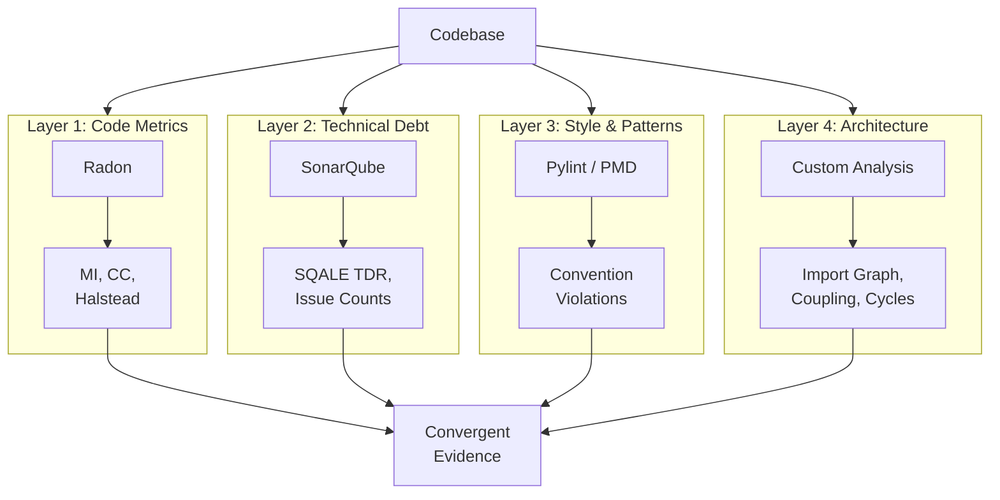

# Maintainability Assessment Methods

**Learning objectives.** After reading this chapter you will be able to (1) calculate the Maintainability Index, Cyclomatic Complexity, and Halstead metrics for a given code sample, (2) explain the Chidamber-Kemerer object-oriented metric suite and its relevance to coupling and cohesion, (3) use Radon to compute metrics for Python code, (4) describe the agreement crisis among static analysis tools and its implications for research, (5) explain the SQALE model and SonarQube's technical debt calculation, (6) design a multi-tool validation strategy for before/after maintainability comparisons, and (7) evaluate the strengths and limitations of current maintainability metric frameworks.

---

## Maintainability Metrics

Maintainability is one of the eight quality characteristics defined by ISO/IEC 25010. But unlike functional correctness, it cannot be directly observed --- it must be *measured* through proxy metrics. This section presents the major metric families used in software engineering research, with formulas, interpretations, and worked examples.

Ardito et al. [@ardito2020maintainability] conducted a systematic literature review of 43 studies (2000--2019), cataloging **174 distinct maintainability metrics**. However, 75% of those metrics appear in only a single paper. The field has converged on a much smaller set of widely-adopted metrics, which we cover here.

### Maintainability Index (MI)

The Maintainability Index is a composite metric designed to provide a single number summarizing how easy a piece of code is to maintain. It was originally proposed by Oman and Hagemeister [@oman1992maintainability] and later adopted by Microsoft Visual Studio and the Python tool Radon.

**Formula (3-metric version):**

$$MI = 171 - 5.2 \cdot \ln(V) - 0.23 \cdot G - 16.2 \cdot \ln(LOC)$$

Where:

| Symbol | Meaning |
|--------|---------|
| $V$ | Halstead Volume (see Section 6.1.3) |
| $G$ | Cyclomatic Complexity (see Section 6.1.2) |
| $LOC$ | Lines of Code (logical, non-comment) |

**Formula (4-metric version, with comments):**

$$MI = 171 - 5.2 \cdot \ln(V) - 0.23 \cdot G - 16.2 \cdot \ln(LOC) + 50 \cdot \sin(\sqrt{2.4 \cdot perCM})$$

Where $perCM$ is the percentage of comment lines. The comment term rewards well-documented code.

**Interpretation:**

| MI Range | Rating | Meaning |
|----------|--------|---------|
| > 85 | A | Easy to maintain |
| 65 -- 85 | B | Moderately maintainable |
| < 65 | C | Difficult to maintain |

**Controversy.** The MI is widely used but not universally accepted. Ardito et al. [@ardito2020maintainability] note that Ostberg and Wagner express doubts about MI's effectiveness, while Sarwar et al. find it efficient. The main criticism is that MI collapses multiple dimensions into a single number, hiding important distinctions. A function with high complexity but low volume might receive the same MI score as one with low complexity but high volume --- yet these require very different remediation strategies.

**Practical note.** Radon (Python) computes MI per module. Microsoft Visual Studio computes it per method and per class. The exact formula varies slightly between implementations, so always report which tool and version you used.

### Cyclomatic Complexity (CC)

Cyclomatic Complexity, introduced by McCabe [@mccabe1976complexity], measures the number of linearly independent paths through a function's control flow graph. It is the most widely used single metric for code complexity.

**Formula:**

$$M = E - N + 2P$$

Where:

| Symbol | Meaning |
|--------|---------|
| $E$ | Number of edges in the control flow graph |
| $N$ | Number of nodes in the control flow graph |
| $P$ | Number of connected components (usually 1 for a single function) |

**Practical shortcut.** For a single function, CC equals the number of decision points plus one. Each `if`, `elif`, `for`, `while`, `and`, `or`, `except`, and `case` adds one to the count.

**Interpretation:**

| CC Range | Risk Level | Meaning |
|----------|-----------|---------|
| 1 -- 10 | Low | Simple, well-structured, easy to test |
| 11 -- 20 | Moderate | More complex, higher testing effort |
| 21 -- 50 | High | Complex, difficult to test and maintain |
| > 50 | Very high | Untestable, error-prone, should be refactored |

Visser [@visser2016maintainable] recommends a stricter threshold of **CC <= 5** for individual units of code, based on SIG's benchmark of hundreds of real systems. This stricter threshold aligns with the guideline "Write Simple Units of Code."

**Example: Calculating CC step by step.**

Consider this Python function:

```python
def categorize_score(score, bonus=False):
    """Categorize a student's score into a grade."""
    if score < 0 or score > 100:        # Decision 1 (if), Decision 2 (or)
        raise ValueError("Invalid score")

    if bonus:                             # Decision 3
        score = min(score + 5, 100)

    if score >= 90:                       # Decision 4
        return "A"
    elif score >= 80:                     # Decision 5
        return "B"
    elif score >= 70:                     # Decision 6
        return "C"
    elif score >= 60:                     # Decision 7
        return "D"
    else:
        return "F"
```

Counting decision points:

| Decision Point | Statement | Count |
|----------------|-----------|-------|
| 1 | `if score < 0` | +1 |
| 2 | `or score > 100` | +1 |
| 3 | `if bonus` | +1 |
| 4 | `if score >= 90` | +1 |
| 5 | `elif score >= 80` | +1 |
| 6 | `elif score >= 70` | +1 |
| 7 | `elif score >= 60` | +1 |

**CC = 7 + 1 (base) = 8.** This falls in the "low risk" range (1--10) but exceeds Visser's stricter threshold of 5. Reducing it would require extracting the grade thresholds into a data structure or splitting the validation from the categorization.

### Halstead Metrics

Halstead's Software Science metrics [@halstead1977elements] treat a program as a sequence of operators and operands and derive complexity measures from their counts. While sometimes criticized as overly reductive, Halstead metrics remain widely used because they capture aspects of code density and cognitive effort that CC alone misses.

**Base counts:**

| Symbol | Meaning | Example |
|--------|---------|---------|
| $n_1$ | Number of **distinct** operators | `+`, `=`, `if`, `return`, `def`, `()`, etc. |
| $n_2$ | Number of **distinct** operands | Variable names, constants, string literals |
| $N_1$ | **Total** number of operator occurrences | Every time an operator is used |
| $N_2$ | **Total** number of operand occurrences | Every time an operand is used |

**Derived metrics:**

| Metric | Formula | Interpretation |
|--------|---------|----------------|
| Program Length | $N = N_1 + N_2$ | Total token count |
| Vocabulary | $n = n_1 + n_2$ | Number of distinct tokens |
| **Volume** | $V = N \cdot \log_2(n)$ | Information content of the program |
| **Difficulty** | $D = \frac{n_1}{2} \cdot \frac{N_2}{n_2}$ | How hard the program is to write or understand |
| **Effort** | $E = D \cdot V$ | Total cognitive effort to develop the program |
| Time to implement | $T = \frac{E}{18}$ | Estimated time in seconds (Stroud number = 18) |
| Bugs predicted | $B = \frac{V}{3000}$ | Estimated number of bugs delivered |

**Volume** is the most commonly used Halstead metric in maintainability research. It appears directly in the MI formula. Higher volume means more information content, which generally correlates with harder-to-maintain code.

**Difficulty** captures how error-prone the code is. It increases when operators are diverse (high $n_1$) and when operands are reused frequently (high $N_2 / n_2$).

### Chidamber-Kemerer (CK) Object-Oriented Suite

For object-oriented systems, the CK metrics suite [@chidamber1994metrics] provides measures of coupling, cohesion, and inheritance complexity at the class level. These metrics are especially relevant for architectural tactics, which often involve restructuring class relationships.

| Metric | Full Name | Definition | What It Measures |
|--------|-----------|-----------|------------------|
| **CBO** | Coupling Between Objects | Count of classes to which a given class is coupled (uses methods, accesses variables, inherits, etc.) | Inter-class coupling |
| **RFC** | Response For a Class | Count of methods that can potentially be executed in response to a message received by an object of the class (own methods + directly called methods) | Communication complexity |
| **WMC** | Weighted Methods per Class | Sum of cyclomatic complexities of all methods in the class | Class complexity |
| **DIT** | Depth of Inheritance Tree | Maximum length from the class to the root of the inheritance hierarchy | Inheritance complexity |
| **NOC** | Number of Children | Count of immediate subclasses | Inheritance breadth |
| **LCOM** | Lack of Cohesion in Methods | Number of pairs of methods that do not share instance variables minus the number that do (if negative, set to 0) | Internal cohesion (inversely) |

**Relevance to architecture:**

- **CBO** is the most frequently cited maintainability metric in the literature --- 18 mentions across the 43 studies in Ardito et al.'s SLR [@ardito2020maintainability]. High CBO means a class is tightly coupled to many others, making changes ripple across the codebase. Architectural tactics that **reduce coupling** (encapsulation, intermediaries, restrict dependencies) directly target CBO.

- **RFC** is the second most cited (17 mentions). A class with high RFC has a large "blast radius" --- calling one of its methods can trigger a chain of calls across many classes. This makes the system harder to understand, test, and modify.

- **LCOM** measures cohesion inversely. A high LCOM means the class's methods operate on disjoint sets of instance variables, suggesting the class has multiple unrelated responsibilities. This is often a sign that the class should be split --- a tactic known as **increase cohesion**.

- **WMC** directly reflects internal complexity. Visser [@visser2016maintainable] maps this to the guideline "Write Simple Units of Code" and recommends keeping individual method CC <= 5, which in turn keeps WMC manageable.

### Comprehensive Metric Reference Table

| Metric | Formula / Definition | Level | Tool(s) | Threshold | Source |
|--------|---------------------|-------|---------|-----------|--------|
| MI | $171 - 5.2\ln(V) - 0.23G - 16.2\ln(LOC)$ | Module | Radon, VS | >85 good, <65 bad | [@oman1992maintainability] |
| CC | $E - N + 2P$ (decision points + 1) | Function | Radon, PMD, SonarQube | 1-10 low risk | [@mccabe1976complexity] |
| Halstead Volume | $V = N \cdot \log_2(n)$ | Function | Radon, JHawk | Lower is simpler | [@halstead1977elements] |
| Halstead Difficulty | $D = (n_1/2) \cdot (N_2/n_2)$ | Function | Radon, JHawk | Lower is simpler | [@halstead1977elements] |
| Halstead Effort | $E = D \cdot V$ | Function | Radon, JHawk | Lower is simpler | [@halstead1977elements] |
| LOC | Logical lines of code | Function/Module | All tools | Minimize | Various |
| CBO | Classes coupled to | Class | CKJM, SonarQube | <9 recommended | [@chidamber1994metrics] |
| RFC | Methods invocable on message | Class | CKJM, Understand | Lower is better | [@chidamber1994metrics] |
| WMC | Sum of method CCs | Class | CKJM, SonarQube | Lower is better | [@chidamber1994metrics] |
| DIT | Max inheritance depth | Class | CKJM, Understand | <6 recommended | [@chidamber1994metrics] |
| NOC | Immediate subclass count | Class | CKJM | Context-dependent | [@chidamber1994metrics] |
| LCOM | Cohesion lack (method pairs) | Class | CKJM | 0 = perfect cohesion | [@chidamber1994metrics] |
| TDR | Remediation cost / dev cost | Project | SonarQube | <5% = A rating | SQALE model |

### Practical Example: Full Metric Calculation with Radon

Consider the following Python module that manages a simple inventory:

```python
# inventory.py
class Inventory:
    """Manages product inventory with basic CRUD operations."""

    def __init__(self):
        self.products = {}
        self.low_stock_threshold = 10

    def add_product(self, name, quantity, price):
        if name in self.products:
            self.products[name]["quantity"] += quantity
        else:
            self.products[name] = {
                "quantity": quantity,
                "price": price
            }

    def remove_product(self, name):
        if name not in self.products:
            raise KeyError(f"Product '{name}' not found")
        del self.products[name]

    def get_total_value(self):
        total = 0
        for name, info in self.products.items():
            total += info["quantity"] * info["price"]
        return total

    def get_low_stock_items(self):
        low_stock = []
        for name, info in self.products.items():
            if info["quantity"] < self.low_stock_threshold:
                low_stock.append(name)
        return low_stock

    def apply_discount(self, name, percent):
        if name not in self.products:
            raise KeyError(f"Product '{name}' not found")
        if percent < 0 or percent > 100:
            raise ValueError("Discount must be between 0 and 100")
        factor = 1 - (percent / 100)
        self.products[name]["price"] *= factor
```

**Computing metrics with Radon:**

```bash
# Maintainability Index (per module)
$ radon mi inventory.py -s
inventory.py - A (67.75)

# Cyclomatic Complexity (per function/method)
$ radon cc inventory.py -s
inventory.py
    C 3:0 Inventory - B (11)
        M 7:4 __init__ - A (1)
        M 10:4 add_product - A (2)
        M 18:4 remove_product - A (2)
        M 23:4 get_total_value - A (1)
        M 29:4 get_low_stock_items - A (2)
        M 35:4 apply_discount - A (3)

# Halstead metrics (per function)
$ radon hal inventory.py
inventory.py:
    __init__:
        h1: 2    h2: 3    N1: 2    N2: 3
        vocabulary: 5    length: 5
        volume: 11.61    difficulty: 1.00
        effort: 11.61    time: 0.65    bugs: 0.00
    add_product:
        h1: 7    h2: 8    N1: 12   N2: 14
        vocabulary: 15   length: 26
        volume: 101.59   difficulty: 6.13
        effort: 622.47   time: 34.58   bugs: 0.03
    ...
```

**Reading the output:**

- The module receives an MI of **67.75**, which is a **B rating** (moderately maintainable). This makes sense --- the code is straightforward but not trivially simple.
- The class `Inventory` has a total CC of **11** (sum of all method CCs), putting it at risk level B. Individual methods range from CC 1 (`__init__`, `get_total_value`) to CC 3 (`apply_discount`).
- Halstead volume for `add_product` is 101.59, reflecting its use of dictionary operations, conditionals, and multiple parameters.

**What these metrics tell us:**
The `Inventory` class is reasonably maintainable at the method level (all methods have low CC) but is accumulating coupling between responsibilities --- it handles CRUD, valuation, stock monitoring, and pricing. An architectural tactic like **Increase Cohesion** (splitting into separate classes for stock management, pricing, and reporting) would reduce WMC and potentially improve MI.

---

## Static Analysis Tools

Static analysis tools (SATs) automate the computation of code metrics and the detection of quality issues. They analyze source code without executing it, making them fast, repeatable, and suitable for CI/CD integration.

### Tool Landscape

| Tool | Language(s) | Focus | Open Source | Key Metrics |
|------|-------------|-------|-------------|-------------|
| **SonarQube** | 30+ languages | Technical debt, code smells, bugs, vulnerabilities | Community edition: Yes | SQALE TDR, issue counts, rating (A--E) |
| **PMD** | Java, Apex, JS, XML | Rule-based pattern detection, copy-paste detection | Yes | Rule violations, CPD duplicates |
| **CheckStyle** | Java | Coding standards, formatting, naming conventions | Yes | Style violations |
| **FindBugs/SpotBugs** | Java (bytecode) | Bug patterns in compiled code | Yes (SpotBugs fork) | Bug pattern counts by category |
| **Radon** | Python | CC, MI, Halstead, LOC, raw metrics | Yes | CC, MI, Halstead Volume/Difficulty/Effort |
| **Pylint** | Python | Coding standards, error detection, refactoring suggestions | Yes | Convention/refactor/warning/error counts, score |
| **ESLint** | JavaScript/TypeScript | Pluggable linting, code quality rules | Yes | Rule violations by severity |

Each tool occupies a different niche. SonarQube is the broadest in language support and issue taxonomy. Radon is the standard for Python-specific complexity metrics. PMD and CheckStyle focus on Java with different emphases (patterns vs. style). FindBugs/SpotBugs analyzes compiled bytecode, catching issues that source-level tools miss.

### The Agreement Crisis

If multiple tools exist for the same purpose, a natural question is: **do they agree?** The answer, based on rigorous empirical evidence, is deeply troubling.

Lenarduzzi et al. [@lenarduzzi2023critical] conducted the largest empirical comparison of static analysis tools to date. They applied six tools (SonarQube, Better Code Hub, Coverity Scan, FindBugs, PMD, and CheckStyle) to **47 Java projects** from the Qualitas Corpus (a standard benchmark dataset) and measured three things: what each tool detects, how much they agree, and how precise their detections are.

**Detection agreement:**

| Tool Pair | Class-Level Agreement |
|-----------|-----------------------|
| FindBugs -- PMD | 9.378% (best) |
| SonarQube -- FindBugs | 4.216% |
| SonarQube -- PMD | 2.881% |
| SonarQube -- CheckStyle | 1.527% |
| CheckStyle -- FindBugs | 0.892% |
| CheckStyle -- PMD | 0.144% (worst) |
| **Overall (all 6 tools)** | **< 0.4%** |

**Less than 0.4% overall agreement.** This means that if you show the same Java class to all six tools, there is less than a 0.4% chance they will all flag the same issue. Even the best pair --- FindBugs and PMD --- agrees less than 10% of the time.

> "The key results show little to no agreement among the tools and a low degree of precision." [@lenarduzzi2023critical]

**Why do tools disagree?** They operate at different abstraction levels (source code vs. bytecode), use different rule sets (936 unique rules across all six tools), and have different goals (style enforcement vs. bug detection vs. debt estimation). Even when two tools have rules that *sound* the same, only 6 out of 66 candidate rule pairs were found to detect the same underlying issue.

**Precision:**

| Tool | Precision | True Positives / Sample |
|------|-----------|------------------------|
| CheckStyle | 86% | 330 / 384 |
| FindBugs | 57% | 217 / 379 |
| PMD | 52% | 199 / 380 |
| Coverity Scan | 37% | 136 / 367 |
| Better Code Hub | 29% | 109 / 375 |
| SonarQube | 18% | 69 / 384 |

SonarQube has the **lowest precision at 18%** --- meaning that roughly 4 out of 5 issues it flags are false positives. However, this must be interpreted carefully: SonarQube also has the broadest rule set and detects the widest variety of issue types. CheckStyle has the highest precision (86%) but predominantly detects formatting and naming violations, not design or architectural issues.

> "There is no silver bullet that is able to guarantee source code quality assessment on its own." [@lenarduzzi2023critical]

**Implication for research:** Any study that uses a single static analysis tool to measure maintainability improvement is measuring what that *particular tool* thinks, not an objective ground truth. Reported improvements may reflect tool-specific biases rather than genuine quality changes.

---

## False Positives and False Negatives

The agreement crisis concerns **what tools detect**. An equally important question is **what they get wrong** and **what they miss entirely**.

### Root Causes of Errors

Cui et al. [@cui2024empirical] conducted the first systematic study of false negatives (FNs) and false positives (FPs) using the analyzers' own bug repositories. They examined **350 confirmed, developer-fixed FN/FP issues** across PMD, SpotBugs, and SonarQube.

| Root Cause | Frequency | Description |
|------------|-----------|-------------|
| Missing cases | 35.7% | Analyzer lacks handling for specific code patterns (e.g., missing whitelisted items, unhandled edge cases) |
| Unhandled language features | 28.9% | New Java features (lambdas, records, pattern matching) not supported by analysis rules |
| Analysis module errors | Varies | Bugs in type resolution, data-flow analysis, or symbolic execution engines |
| Incorrect rule logic | Varies | The rule's implementation does not match its specification |

### What Triggers Failures

The study identified **10 input characteristics** that commonly trigger FN/FP errors:

| Input Characteristic | Frequency | Example |
|---------------------|-----------|---------|
| Annotations | 21.07% | Tools fail to model annotation semantics (e.g., `@Nullable`, `@Override`) |
| Complex expressions | 15.4% | Nested ternary operators, lambda chains |
| Generics / Type parameters | 12.1% | Parameterized types confuse type resolution |
| Try-with-resources | 8.2% | Resource management constructs misanalyzed |
| Inter-procedural flows | Varies | Tools cannot track values across method boundaries |

**The false negative problem is especially concerning.** While false positives waste developer time, false negatives provide a *false sense of security*. If a tool reports no issues, developers may believe the code is clean when it is not. Cui et al. found that PMD's data-flow analysis is limited to reaching-definition analysis only and cannot handle basic inter-procedural call flows. SonarQube's symbolic execution engine has limitations in tracking runtime types outside method boundaries.

> "Unfortunately, this rule is (implemented as) AST-based, and it brings some limitations. So to eliminate these false positives the rule should rely on the data flow." --- SonarQube developer [@cui2024empirical]

### Implications for Before/After Studies

When a thesis compares maintainability metrics before and after an intervention (such as applying an architectural tactic), the reliability of the measurement instrument matters enormously. If the tool has:

- **High FP rate:** Improvements may appear where none exist (the tool stops flagging false positives after refactoring changes the code structure).
- **High FN rate:** Real problems may be hidden both before and after, making the comparison meaningless.
- **Inconsistent behavior:** The same pattern in different syntactic forms may be detected before refactoring but missed after (or vice versa).

This is why multi-tool validation (Section 6.5) and statistical testing are essential.

---

## SonarQube and the SQALE Model

Despite its low precision, SonarQube is the most widely used static analysis platform in both industry and research. Understanding its measurement model is essential for interpreting its output correctly.

### The SQALE Model

SonarQube uses the **SQALE** (Software Quality Assessment based on Lifecycle Expectations) model to estimate technical debt. The core idea is:

1. For every detected issue, SonarQube estimates the **remediation effort** --- how many minutes it would take a developer to fix the issue.
2. The sum of all remediation efforts is the **technical debt** (expressed in minutes, hours, or days).
3. The **Technical Debt Ratio (TDR)** normalizes this against the estimated development cost:

$$TDR = \frac{\text{Remediation Cost (total fix effort)}}{\text{Development Cost (estimated effort to rewrite)}}$$

4. TDR maps to a **letter rating**:

| Rating | TDR Range | Interpretation |
|--------|-----------|----------------|
| **A** | < 5% | Minimal technical debt |
| **B** | 6 -- 10% | Low technical debt |
| **C** | 11 -- 20% | Moderate technical debt |
| **D** | 21 -- 50% | High technical debt |
| **E** | > 50% | Very high technical debt, remediation cost exceeds half the rewrite cost |

### Issue Taxonomy

SonarQube classifies issues into three categories:

| Category | Definition | Example |
|----------|-----------|---------|
| **Code Smells** | Maintainability issues that make code harder to understand or modify | Long methods, excessive parameters, god classes |
| **Bugs** | Reliability issues that could cause incorrect behavior | Null pointer dereferences, resource leaks |
| **Vulnerabilities** | Security issues that could be exploited | SQL injection, hardcoded credentials |

### SonarQube in Practice

Nocera et al. [@nocera2025sonarqube] mined **321 GitHub projects** using SonarQube Cloud to understand how the tool is actually configured and used in open-source development.

**Key findings:**

| Finding | Value |
|---------|-------|
| Projects using default "Sonar way" quality gate | 55% |
| Projects with customized quality gates | 45% |
| Projects enforcing maintainability rating on new code | 89.06% |
| Projects enforcing security rating on new code | 90.94% |
| Projects enforcing reliability rating on new code | 88.68% |
| Projects enforcing coverage on new code | 77.36% (least common built-in condition) |

The finding that **89% of projects enforce a maintainability rating** on new code validates that maintainability is a priority quality attribute in real-world development, not just an academic concern. This also means SonarQube's maintainability rating is the *de facto* industry standard for automated maintainability assessment.

**Important caveat from Nocera et al.:** Issue count reduction does not necessarily equal debt reduction. They found ratios as low as 0.71 between the two --- meaning you can fix many issues without significantly reducing overall technical debt if the remaining issues are high-effort ones. This has direct implications for evaluating LLM-driven interventions: counting resolved issues is not sufficient; you must track actual debt reduction (in remediation-time units).

### Cloud vs. On-Premise

Nocera et al. also note differences between SonarQube Cloud and on-premise installations. The cloud version follows the "Clean as You Code" philosophy, which focuses quality gates on *new code* rather than the entire codebase. This means the quality gate only triggers on changes since the last version, which is philosophically aligned with the thesis approach: we apply tactics to specific parts of the code and measure whether those changes improve metrics.

---

## Multi-Tool Validation Strategy

Given the agreement crisis (< 0.4%) and the precision problems documented above, relying on a single tool for maintainability assessment is methodologically unsound. This section presents a principled strategy for combining multiple tools.

### Why One Tool Is Never Enough

The evidence is unambiguous:

| Problem | Evidence | Source |
|---------|----------|--------|
| Tools disagree on what to flag | < 0.4% overall agreement | [@lenarduzzi2023critical] |
| Tools have high false positive rates | SonarQube: 18%, PMD: 52% precision | [@lenarduzzi2023critical] |
| Tools have systematic blind spots | 35.7% of FN/FP issues from missing cases | [@cui2024empirical] |
| Tools miss entire categories of issues | FN rates significant across all analyzers | [@cui2024empirical] |
| Issue counts and debt reduction diverge | Ratio as low as 0.71 | [@nocera2025sonarqube] |

No single tool provides a complete picture. Different tools catch different things. Combining them increases both coverage and confidence.

### Recommended Tool Combination

For a research study evaluating maintainability before and after an intervention, the following four-layer strategy is recommended:



| Layer | Tool | What It Measures | Why Include It |
|-------|------|------------------|----------------|
| **1. Code-level metrics** | Radon (Python) | MI, CC, Halstead Volume/Difficulty/Effort, LOC, raw metrics | Precise, reproducible, formula-based; no subjective rule interpretation |
| **2. Technical debt estimation** | SonarQube | SQALE TDR, issue counts by category (smells, bugs, vulnerabilities), maintainability rating | Industry standard; normalized debt metric enables cross-project comparison |
| **3. Style and pattern violations** | Pylint (Python) or PMD (Java) | Convention violations, refactoring suggestions, error patterns, code score | Catches language-specific anti-patterns that Radon misses |
| **4. Architecture-level** | Custom analysis | Import graph coupling, module cohesion, layer violations, dependency cycles | Captures architecture-level effects that file-level tools cannot detect |

**Layer 1 (Radon)** provides the *objective baseline*: formulas computed deterministically from the source code. There is no ambiguity about what CC or MI means. These metrics are the primary comparison variables.

**Layer 2 (SonarQube)** provides the *industry-standard view*: technical debt in minutes, severity-classified issues, and the A--E rating that practitioners and CI/CD pipelines actually use. Despite its low precision (18%), it captures the broadest range of issue types and is the metric most likely to be meaningful to practitioners.

**Layer 3 (Pylint/PMD)** provides *language-specific detail*: naming conventions, import order, unused variables, and refactoring opportunities that neither Radon nor SonarQube focus on. Pylint's numeric score (0--10) provides a simple before/after comparison point.

**Layer 4 (Custom)** is essential because **no commercial tool measures architecture-level maintainability well**. Import graph analysis can detect coupling between modules, identify circular dependencies, and measure whether tactic implementations actually change the dependency structure. This is the layer most directly relevant to architectural tactics.

### Statistical Methods for Before/After Comparison

When comparing metrics before and after applying an architectural tactic, raw numbers are insufficient. You need statistical evidence that the change is both *significant* (not due to chance) and *meaningful* (large enough to matter).

**Effect size with Cliff's Delta ($\delta$):**

Cliff's Delta is a non-parametric effect size measure suitable for ordinal data and non-normal distributions. It quantifies how often values in one group exceed values in the other.

| $|\delta|$ Range | Interpretation |
|------------------|----------------|
| $\leq 0.147$ | Negligible effect |
| $0.148 - 0.330$ | Small effect |
| $0.331 - 0.474$ | Medium effect |
| $> 0.474$ | Large effect |

**Significance testing with Wilcoxon signed-rank test:**

When the same modules are measured before and after treatment (a paired design), the Wilcoxon signed-rank test is appropriate because it does not assume normality. A p-value < 0.05 indicates a statistically significant change.

**Multiple comparison correction with Benjamini-Hochberg:**

When testing multiple metrics simultaneously (e.g., CC, MI, Halstead, and CBO for the same dataset), the risk of false positives increases. The Benjamini-Hochberg FDR (False Discovery Rate) correction controls the expected proportion of false discoveries. This is preferable to the more conservative Bonferroni correction when testing many hypotheses.

**Example analysis workflow:**

```python
from scipy.stats import wilcoxon
from cliffs_delta import cliffs_delta  # pip install cliffs-delta

# Before and after MI values for 50 modules
mi_before = [72.3, 65.1, 81.4, ...]  # measured before tactic
mi_after  = [78.9, 71.2, 83.1, ...]  # measured after tactic

# 1. Effect size
delta, interpretation = cliffs_delta(mi_after, mi_before)
print(f"Cliff's Delta: {delta:.3f} ({interpretation})")

# 2. Significance test
stat, p_value = wilcoxon(mi_before, mi_after, alternative='less')
print(f"Wilcoxon p-value: {p_value:.4f}")

# 3. Apply Benjamini-Hochberg correction if testing multiple metrics
from statsmodels.stats.multitest import multipletests
p_values = [p_mi, p_cc, p_halstead, p_cbo]  # one per metric
rejected, corrected_p, _, _ = multipletests(p_values, method='fdr_bh')
```

This workflow ensures that reported improvements are statistically rigorous and not artifacts of tool noise or multiple testing.

---

## Ardito et al.'s SLR on Maintainability Metrics

We have referenced Ardito et al. [@ardito2020maintainability] throughout this chapter, but their systematic literature review deserves dedicated attention as the most comprehensive survey of the metric landscape.

### Scope and Method

The SLR followed Kitchenham's guidelines, screening 801 papers from four digital libraries (ACM, IEEE Xplore, Scopus, Web of Science) and selecting 43 primary studies published between 2000 and 2019.

### The 174 Metrics Problem

The SLR identified **174 distinct maintainability metrics**, organized into 10 metric suites. However, the distribution is extremely long-tailed:

- **75% of all 174 metrics are mentioned by only a single paper.** There is no broad consensus on most of these metrics.
- The field has effectively converged on a core set of **15 most-mentioned metrics** (those scoring above the median in Ardito et al.'s frequency analysis).

**The 15 most-mentioned metrics:**

| Rank | Metric | Mentions | Suite |
|------|--------|----------|-------|
| 1 | CBO (Coupling Between Objects) | 18 | CK |
| 2 | RFC (Response For a Class) | 17 | CK |
| 3 | LOC (Lines of Code) | 15 | Size |
| 4 | CC (Cyclomatic Complexity) | 14 | McCabe |
| 5 | WMC (Weighted Methods per Class) | 14 | CK |
| 6 | DIT (Depth of Inheritance Tree) | 13 | CK |
| 7 | LCOM (Lack of Cohesion in Methods) | 12 | CK |
| 8 | NOC (Number of Children) | 11 | CK |
| 9 | Halstead suite (6 metrics) | 10 | Halstead |
| 10 | MI (Maintainability Index) | 9 | Composite |
| 11 | NOM (Number of Methods) | 8 | Size |
| 12 | NPM (Number of Public Methods) | 7 | CK Extended |
| 13 | MPC (Message Passing Coupling) | 6 | Coupling |
| 14 | CE (Efferent Coupling) | 6 | Martin |
| 15 | CLOC (Comment Lines of Code) | 5 | Size |

Notice that **5 of the top 8 metrics are from the CK suite**. Object-oriented coupling and cohesion metrics dominate the maintainability measurement landscape.

### Tool Coverage

Ardito et al. catalog **19 available tools** (6 closed-source, 13 open-source) across 34 programming languages. Key findings about tool coverage:

- **CC** is supported by 13 of 19 tools --- the best-supported metric.
- **LOC** is supported by 14 of 19 tools.
- **LCOM2 and MPC** are not explicitly supported by any open-source tool, creating a coverage gap for researchers who need fully open-source toolchains.
- **Java** has the best tool support (13 tools), followed by C/C++ (12), JavaScript (10), and C# (9).
- For Java, the optimal tool set requires **5 tools** to cover all 15 most-mentioned metrics.
- **CKJM** (Chidamber-Kemerer Java Metrics) is the most cited tool in the literature (5 papers) but supports only Java.

### The Standardization Gap

Perhaps the most important finding for researchers is the **lack of standardization**. Different tools compute "the same" metric differently:

- **LOC** has at least 3 common definitions: physical lines, logical lines (statements), and non-blank non-comment lines. Different tools use different definitions.
- **MI** has at least 2 formulas in common use (3-metric and 4-metric versions), and Radon normalizes it to a 0--100 scale while some tools use the raw formula that can exceed 100.
- **LCOM** has multiple definitions (LCOM1 through LCOM5), and tools rarely specify which version they compute.

This means that metric values from different tools are **not directly comparable**. Research studies must report the exact tool, version, and configuration used, and comparisons between studies that used different tools must be interpreted with extreme caution.

### The Missing Benchmark

Ardito et al. identify a critical gap: **there is no standard benchmark dataset for calibrating maintainability tools**. Unlike in other areas of software engineering (e.g., the Defects4J benchmark for fault localization), there is no agreed-upon codebase with known maintainability scores that can be used to validate tools. This means every tool's thresholds are calibrated against different data, making cross-tool comparison inherently difficult.

Visser [@visser2016maintainable] partially addresses this through the SIG benchmark, which rates systems on a 1--5 star scale based on empirical benchmarks from hundreds of real systems. SIG recalibrates annually, ensuring thresholds reflect current coding practices. The predictive power is demonstrated by their finding that issue resolution is **2x faster in 4-star vs. 2-star systems** --- a concrete validation that the metrics predict actual maintainability outcomes.

However, the SIG benchmark is proprietary and language-specific (Java-focused), limiting its availability to the broader research community.

---

## Review Questions

1. **Calculate** the Maintainability Index for a module with Halstead Volume = 500, Cyclomatic Complexity = 12, and LOC = 80. What rating does it receive?

2. A function has the following control flow: one `if-elif-else` chain with 4 branches, a `for` loop, and a `try-except` block. **Calculate** its Cyclomatic Complexity. Is this acceptable by McCabe's threshold? By Visser's threshold?

3. **Explain** the difference between Halstead Volume and Halstead Difficulty. Why does the MI formula use Volume rather than Difficulty?

4. Lenarduzzi et al. found that SonarQube has 18% precision. **Discuss** what this means for a researcher who reports "SonarQube detected 200 fewer code smells after applying our technique." How confident should we be in this claim?

5. **Design** a multi-tool validation strategy for evaluating the maintainability impact of refactoring a Python web application. Specify which tools you would use, what metrics you would track, and how you would determine if the improvement is statistically significant.

6. Ardito et al. found that 75% of the 174 cataloged metrics appear in only a single paper. **Discuss** what this implies about the maturity of maintainability measurement as a field. Should researchers use only the top 15 metrics, or is there value in exploring less-popular ones?

7. Explain the SQALE Technical Debt Ratio. A project has a remediation cost of 40 hours and an estimated development cost of 500 hours. **Calculate** the TDR and assign a SonarQube rating.

8. Cui et al. found that "missing cases" account for 35.7% of FN/FP issues. **Give** a concrete example of how this could affect a before/after maintainability study (i.e., how a missing case could make a refactoring appear to improve or worsen a metric when it actually did neither).

9. Nocera et al. found that issue count reduction and debt reduction can diverge (ratio 0.71). **Explain** why this happens and what metric (issue count or TDR) is more meaningful for evaluating architectural tactic effectiveness.

10. **Compare** the SIG assessment model (Visser) with the SQALE model (SonarQube). What are the strengths and weaknesses of each for evaluating LLM-generated code changes?
