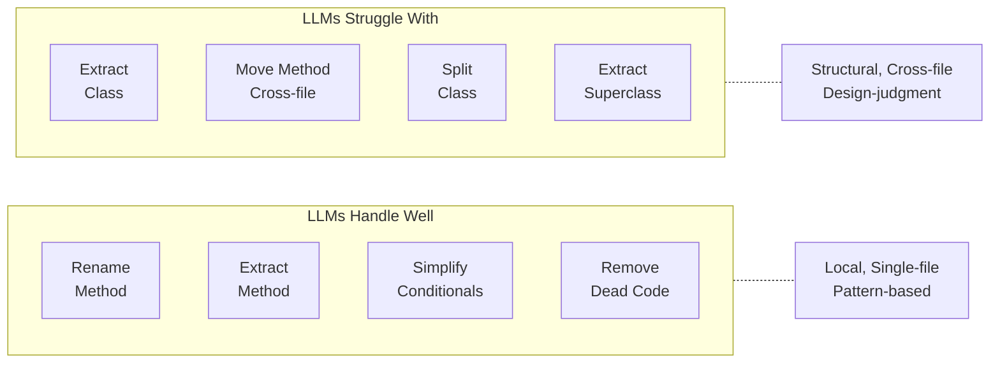
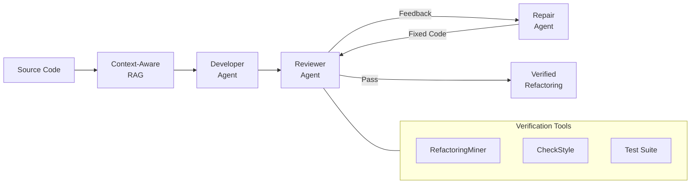

# Large Language Models for Code Refactoring

> **Learning objectives.** After reading this chapter you should be able to (1) describe the paradigm shift from syntax-level code completion to semantic-level code transformation, (2) evaluate the strengths and limitations of standalone LLM refactoring, (3) design effective prompts for refactoring tasks using empirically validated strategies, (4) explain the multi-agent and tool-integrated pipeline architectures that dramatically improve refactoring success rates, (5) compare behavior preservation methods and their reliability, and (6) articulate the gap between code-level refactoring and the architecture-level transformations that motivate this thesis.

---

## The LLM Revolution in Software Engineering

### From code completion to code transformation

The application of large language models to software engineering has undergone a rapid and consequential evolution. GitHub Copilot, launched in 2021, demonstrated that transformer-based models trained on vast corpora of source code could autocomplete functions and suggest boilerplate with surprising accuracy. But autocomplete is fundamentally a *syntactic* operation: the model predicts the next likely tokens given a local context window.

By 2023, the field had shifted decisively toward *code transformation* --- the use of LLMs not merely to extend code but to restructure, refactor, and improve it. This shift matters because refactoring is not about writing new functionality; it is about understanding *existing* code deeply enough to reorganize it without changing what it does. That requires semantic understanding: knowing what a method *means*, which variables carry state, where side effects lurk, and how components interact. Martinez et al., in their systematic literature review of 50 primary studies drawn from 8 databases (867 initial publications narrowed to 50 through a Kitchenham-protocol screening process), confirm that the LLM-refactoring intersection has become one of the most active areas in software engineering research, with Java dominating (66% of studies) and Python second (44%) [@martinez2025refactoring].

The paradigm shift can be stated simply: **LLMs understand code semantics, not just syntax.** They can identify that two loops perform the same traversal, that a deeply nested conditional could be flattened into a guard clause, or that three scattered database calls could be consolidated into a repository class. This capability makes them plausible candidates for automated refactoring --- and potentially for the architectural transformations that this study guide is building toward.

### Key models and their characteristics

Different LLM models exhibit different strengths and weaknesses for refactoring tasks. The table below synthesizes findings from multiple empirical studies to characterize the models most commonly used in the literature.

| Model | Provider | Parameters | Best At | Limitations | Source |
|-------|----------|-----------|---------|-------------|--------|
| GPT-3.5 | OpenAI | 175B | Simple refactorings (rename, reformat); behavior preservation (97.2%) | Defaults to readability improvements regardless of target quality attribute; cannot distinguish coupling from cohesion | [@depalma2024exploring] |
| GPT-4 / GPT-4o | OpenAI | ~1.8T (est.) | Opportunity identification (86.7% recall with optimized prompts); 63.6% of solutions comparable to or better than human experts | Limited to <300 LOC for practical use; 7.4% of solutions introduce semantic bugs | [@liu2025exploring] |
| GPT-4o-mini | OpenAI | Undisclosed | Multi-agent pipelines (MANTRA: 82.8% success); cost-efficient (<$0.10 per refactoring) | Requires orchestration framework; cannot handle Move Method to new classes | [@xu2025mantra; @piao2025refactoring] |
| DeepSeek-V3 | DeepSeek | 671B (MoE) | Benchmark refactoring (100% success with Step-by-Step/Rule-based instructions on 48/61 Fowler types) | Lower compilation rate on real projects (38--51%); hallucinations from insufficient context | [@piao2025refactoring] |
| StarCoder2-15B | BigCode | 15B | Code smell reduction (44.4% vs. 24.3% for developers); open-source, training data known | Low Pass@1 (28.4%); struggles with cross-class refactorings; single-file scope | [@cordeiro2024llm] |
| Gemini 1.0 Pro | Google | Undisclosed | Robust across configurations in iterative pipelines; fewer unsafe solutions (6.6%) | Lower recall than GPT-4 for opportunity identification (21.1% vs. 52.2% with type-specified prompts) | [@liu2025exploring; @goncalves2025sonarqube] |
| Claude | Anthropic | Undisclosed | Iterative SonarQube pipelines; agentic coding workflows | Only 0.6% of agentic commits in AIDev dataset; limited empirical data on refactoring-specific performance | [@goncalves2025sonarqube; @horikawa2025agentic] |

Several patterns emerge from this comparison. First, **model size alone does not predict refactoring success** --- GPT-4o-mini within the MANTRA framework (82.8%) vastly outperforms raw GPT-4 (8.7% baseline), demonstrating that pipeline architecture matters more than raw model capability. Second, **open-source models** like StarCoder2-15B show strong performance on pattern-based code improvements but lag behind commercial models on complex structural transformations. Third, **all models** struggle with cross-file, architecture-level reasoning --- a limitation we will return to in Section 7.8.

---

## Standalone LLM Refactoring

### DePalma et al.: the pioneering quality-attribute study

The first systematic evaluation of LLM refactoring capabilities across multiple quality attributes was conducted by DePalma et al. [@depalma2024exploring]. Their study tested ChatGPT (GPT-3.5) on 40 Java code segments, asking it to refactor each segment targeting eight distinct quality attributes: Performance, Complexity, Coupling, Cohesion, Design Size, Readability, Reusability, and Understandability. This produced 320 total refactoring trials.

The headline results were encouraging:

- **99.7% refactoring rate** --- ChatGPT produced a refactored version in 319 of 320 trials.
- **97.2% behavior preservation** --- 311 of 320 refactored segments maintained their original behavior (assessed via ChatGPT self-evaluation).
- **98.8% documentation accuracy** --- ChatGPT correctly identified the goal of its own refactoring in nearly every case.

It is important to understand what these numbers *do* and *do not* mean. The quality attributes tested are *not* Fowler refactoring types (Extract Method, Inline Variable, etc.). They are broader quality concerns. DePalma et al. found that regardless of which quality attribute was specified in the prompt, **ChatGPT predominantly performed generic operations**: variable and method renaming to follow Java conventions, code reformatting, and loop simplification. When asked to improve "coupling," it still produced readability improvements. The authors noted:

> "The two primary attributes ChatGPT reported were readability and maintainability which suggests that ChatGPT has a limited ability to refactor code segments to improve more sophisticated quality attributes like cohesion and coupling." [@depalma2024exploring]

This finding carries a crucial lesson: **LLMs default to superficial improvements** unless the prompt provides very specific quality-attribute keywords. When the prompt included phrases like "quality and performance," ChatGPT triggered more substantive changes. But even then, it struggled to distinguish between architectural quality attributes that require structural understanding.

### Haindl and Weinberger: novice programmer code quality

A complementary perspective comes from Haindl and Weinberger's controlled experiment comparing code written by novice programmers with and without ChatGPT assistance [@haindl2024chatgpt]. In a university Java course, 22 students used ChatGPT while 16 did not. Static analysis revealed that the ChatGPT-assisted group produced code with:

- **Significantly lower cyclomatic complexity** (p < 0.005)
- **Fewer coding convention violations** across 10 Checkstyle rule categories

However, not all metrics improved. Code length *increased* in the ChatGPT-assisted group, and some SonarQube metrics worsened. This mixed result --- improvement on some dimensions, regression on others --- foreshadows a theme that will recur throughout this chapter: **refactoring benefits are multi-dimensional**, and a single metric never tells the whole story.

### What LLMs handle well vs. poorly

Synthesizing evidence from DePalma et al. [@depalma2024exploring], Liu et al. [@liu2025exploring], Cordeiro et al. [@cordeiro2024llm], and Horikawa et al. [@horikawa2025agentic], we can categorize refactoring types by how well standalone LLMs handle them:

| Well Handled | Poorly Handled |
|-------------|----------------|
| Rename Method/Variable | Extract Class |
| Extract Method | Move Method (cross-file) |
| Simplify Conditionals | Inline Class |
| Remove Dead Code | Pull Up / Push Down Method |
| Inline Variable | Extract Superclass |
| Change Variable Type | Split Class |

**Why the "well handled" types succeed.** These are *local* transformations that operate within a single method or class. Rename operations require only lexical understanding. Extract Method requires identifying a coherent block of statements and their input/output variables --- a pattern that LLMs learn well from training data. Simplifying conditionals (e.g., replacing nested if-else chains with guard clauses) follows well-known refactoring patterns that appear frequently in open-source code. Remove Dead Code requires recognizing unreachable statements, which LLMs can do within a visible context window.

**Why the "poorly handled" types fail.** These are *structural* transformations that require reasoning about relationships *between* classes, modules, or packages. Extract Class demands understanding which subset of fields and methods form a coherent abstraction --- a design judgment, not a pattern match. Move Method requires knowing the dependency graph across files. Pull Up / Push Down involves inheritance hierarchies and Liskov substitution concerns. Liu et al. reported **0% recall for Extract Class** with generic prompts on both GPT-4 and Gemini [@liu2025exploring]. Cordeiro et al. confirmed that developers outperform LLMs precisely on "complex structural" refactorings: Move Method, Extract Superclass, Pull Up Method, and Move Source Folder [@cordeiro2024llm].

The pattern is clear: **LLMs excel at within-file, pattern-based transformations and fail at cross-file, design-judgment transformations.** This is the central limitation that motivates the multi-agent and tool-integrated approaches described in the next sections.



---

## Prompt Engineering for Refactoring

### Piao et al.: systematic instruction strategies

The most comprehensive study of prompt engineering for refactoring is Piao et al.'s evaluation of five instruction strategies across all 61 refactoring types from Fowler's catalog [@piao2025refactoring]. This study is remarkable for its breadth: rather than testing a handful of refactoring types, the authors systematically covered the entire canonical catalog.

The five strategies, along with their benchmark success rates for GPT-4o-mini and DeepSeek-V3, are shown below:

| Strategy | Description | GPT-4o-mini Success | DeepSeek-V3 Success | Example Prompt Fragment |
|----------|-------------|:-------------------:|:-------------------:|------------------------|
| Zero-Shot | Just the refactoring name, no explanation | 47.5% | 91.8% | "Apply Extract Method refactoring to this code." |
| Two-Shot | Two worked examples before the request | 57.4% | 95.1% | [Example 1 before/after] + [Example 2 before/after] + "Now apply to this code:" |
| Step-by-Step | Human-oriented procedural instructions | 83.6% | 100% | "1. Identify the code block to extract. 2. Create a new method. 3. Replace the block with a call..." |
| Rule-based | Machine-oriented detection heuristics | 80.3% | 100% | "If method M has LOC > 20 and contains a block B used only once, extract B into a new method..." |
| Objective Learning | Only the high-level quality goal | 29.5--36.1% | 31.1--37.7% | "Improve the maintainability of this code." |

The **key finding** is dramatic: moving from a generic prompt to a subcategory-specific prompt boosts success from 15.6% to 86.7% (Liu et al.'s finding using GPT-4 with narrowed scope) [@liu2025exploring]. Piao et al. confirmed a similar trajectory: zero-shot prompts achieve 47.5% on GPT-4o-mini, while step-by-step instructions reach 83.6%.

Several insights deserve special attention:

1. **Rule-based instructions outperform human-oriented step-by-step for GPT-4o-mini.** This is counterintuitive --- one might expect that natural language steps would be easier for a language model. But rule-based heuristics (derived from automated refactoring detection tools like Ref-Finder) provide precise pre- and post-conditions that the LLM can follow mechanically. As Piao et al. note: "Rule-based instructions adapted from heuristics used in automated refactoring detection enable GPT-4o-mini to produce compilable, semantically preserved code more effectively than step-by-step, human-oriented instructions" [@piao2025refactoring].

2. **The Objective Learning paradox.** When given only a high-level goal ("improve maintainability"), LLMs produce the *lowest* correctness (29--36%) in terms of performing the intended refactoring type. But paradoxically, the code they produce achieves the *best* quality metrics --- the lowest cyclomatic complexity and lines of code. The explanation: freed from the constraint of performing a specific transformation, the LLM applies whatever improvements it deems best, which often results in substantial restructuring that happens to improve metrics even if it does not match the intended refactoring type.

3. **DeepSeek-V3 achieves 100% on 48 of 61 Fowler types** with both Step-by-Step and Rule-based strategies. This suggests that the refactoring capability gap is closing rapidly for well-specified single-file transformations.

### Liu et al.: prompt structure and optimization

Liu et al.'s study provides complementary evidence on prompt structure [@liu2025exploring]. They tested GPT-4 and Gemini-1.0 Pro on 180 real-world refactorings from 20 open-source Java projects, systematically varying prompt specificity.

Their findings on prompt optimization:

- **Generic prompts** ("Identify refactoring opportunities in this code") yield only 15.6% recall for GPT-4 and 3.9% for Gemini.
- **Type-specified prompts** ("Identify Extract Method opportunities") boost recall to 52.2% for GPT-4 --- a 235% improvement.
- **Subcategory + narrowed scope prompts** ("Identify Extract Method opportunities in the calculateTotal method, specifically looking for blocks that can be extracted into helper methods") achieve **86.7% recall** for GPT-4.
- **Code size effect:** A moderate negative correlation (-0.38 for GPT-4) exists between code size and refactoring quality. Practical use is confined to fragments of **<300 LOC**.

### Practical example: the same refactoring, three prompts

To make these abstract findings concrete, consider an Extract Method refactoring applied to a Python function that calculates order totals with tax and discount logic interleaved:

**Original code:**
```python
def process_order(order):
    subtotal = 0
    for item in order.items:
        price = item.unit_price * item.quantity
        if item.is_taxable:
            price += price * order.tax_rate
        if item.discount_code:
            discount = lookup_discount(item.discount_code)
            price -= price * discount.percentage
        subtotal += price
    shipping = calculate_shipping(order.weight, order.destination)
    return subtotal + shipping
```

**Prompt Strategy 1 --- Zero-Shot:**
```
Apply Extract Method refactoring to this code.
```

*Typical LLM output:* The model might extract the shipping calculation but leave the complex loop body untouched, or it might rename variables but not restructure the logic. Success is unpredictable.

**Prompt Strategy 2 --- Step-by-Step:**
```
Apply Extract Method refactoring to the following code.
Steps:
1. Identify the block within the for-loop that computes the price
   for a single item (including tax and discount).
2. Extract that block into a new method called calculate_item_price
   that takes an item and the tax_rate as parameters.
3. Replace the original block with a call to calculate_item_price.
4. Ensure the new method returns the computed price.
```

*Typical LLM output:*
```python
def calculate_item_price(item, tax_rate):
    price = item.unit_price * item.quantity
    if item.is_taxable:
        price += price * tax_rate
    if item.discount_code:
        discount = lookup_discount(item.discount_code)
        price -= price * discount.percentage
    return price

def process_order(order):
    subtotal = sum(
        calculate_item_price(item, order.tax_rate)
        for item in order.items
    )
    shipping = calculate_shipping(order.weight, order.destination)
    return subtotal + shipping
```

**Prompt Strategy 3 --- Rule-Based:**
```
Apply Extract Method refactoring.
Rule: If a loop body contains > 5 statements and uses local variables
that can be parameterized, extract the body into a separate method.
Pre-condition: The block must have clearly identifiable inputs
(parameters) and a single output (return value).
Post-condition: The original loop calls the new method; all variable
references are preserved; behavior is identical.
Target: The for-loop body in process_order.
```

*Typical LLM output:* Very similar to Strategy 2, but with more consistent handling of edge cases (e.g., correctly parameterizing `tax_rate` rather than accessing it through `order`). Rule-based prompts reduce ambiguity about *what* to extract and *how* to parameterize it.

The practical takeaway: **always specify the refactoring type, the target code region, and either step-by-step instructions or formal pre/post-conditions.** Generic prompts waste tokens and produce unreliable results.

### Cross-study prompt taxonomy

Martinez et al.'s SLR synthesizes prompt engineering practices across all 50 reviewed studies into seven categories [@martinez2025refactoring]:

| Technique | Studies | Share | Key Finding |
|-----------|:-------:|:-----:|-------------|
| Context-Specific | 27 | 22% | Most commonly used; provides codebase context, usage patterns, quality goals |
| Few-Shot | 25 | 21% | Most effective for Python (reduced CC by 17.35%, LOC by 25.85%) |
| Zero-Shot | 19 | 16% | Baseline with minimal context |
| Chain-of-Thought | 18 | 15% | Improves diversity and adds new refactoring types; not always correctness |
| Output Constraints | 15 | 12% | Format/correctness specifications (e.g., "return valid JSON") |
| One-Shot | 12 | 10% | Highest unit test pass rate (34.51%) and smell reduction (42.97%) for Java |
| Ranking | 2 | 2% | Generate multiple versions and rank --- the least explored technique |

The SLR reveals that no single prompting technique dominates across all contexts: Context-Specific and Few-Shot are most prevalent, but One-Shot achieves the best correctness metrics for Java, while Chain-of-Thought enables LLMs to handle refactoring types they otherwise cannot attempt (Extract Method, Extract Class, Add Parameter). The *Ranking* approach --- generating multiple candidate refactorings and selecting the best one --- is almost entirely unexplored despite its natural fit for quality-metric-driven optimization.

---

## Multi-Agent Frameworks

### MANTRA: multi-agent refactoring with RAG

The most significant advance in LLM-based refactoring to date is MANTRA (Multi-Agent eNhanced refacToring with RAG), developed by Xu et al. [@xu2025mantra]. MANTRA addresses the central weakness of standalone LLM refactoring --- the lack of project context and verification --- through a coordinated multi-agent architecture.

**Architecture.** The following diagram illustrates MANTRA's multi-agent pipeline:



MANTRA employs three specialized agents orchestrated by LangGraph:

1. **Developer Agent** --- generates the refactored code, informed by Context-Aware RAG that retrieves similar past refactorings, API documentation, and project conventions.
2. **Reviewer Agent** --- validates the generated code using traditional SE tools (RefactoringMiner for verifying that the intended refactoring type occurred, CheckStyle for style compliance, compilation and test execution for functional correctness). Provides structured feedback to the Developer Agent.
3. **Repair Agent** --- receives feedback from the Reviewer and iteratively fixes compilation errors, test failures, and style violations using Verbal Reinforcement Learning (Reflexion).

The RAG component is particularly important. It uses a hybrid retrieval strategy (BM25 sparse retrieval + all-MiniLM-L6-v2 dense retrieval, merged via Reciprocal Rank Fusion) to provide the Developer Agent with contextually relevant information: how similar refactorings were performed in the same project, what APIs are available, and what coding conventions are expected.

**Results.** MANTRA was evaluated on 703 pure structural refactorings from 10 open-source Java projects (checkstyle, pmd, commons-lang, hibernate-search, junit4, commons-io, javaparser, junit5, hibernate-orm, mockito):

| Metric | MANTRA (GPT-4o-mini) | RawGPT Baseline | Improvement |
|--------|:--------------------:|:---------------:|:-----------:|
| Compile + Test + Verified success | 82.8% (582/703) | 8.7% (61/703) | 9.5x |
| CodeBLEU similarity to human code | 0.640 | 0.517 | +23.8% |
| AST Diff Precision / Recall | 0.781 / 0.635 | 0.773 / 0.574 | +10.6% recall |
| Identical to developer refactoring | 18.0% | 13.1% | +37.4% |
| Cost per refactoring | <$0.10 | --- | --- |

The contrast between **82.8%** (MANTRA) and **8.7%** (raw GPT-4) is the single most important number in the LLM refactoring literature. It demonstrates that pipeline architecture --- not model capability alone --- determines success.

**Ablation study.** The ablation results reveal which components matter most:

| Component Removed | Success Rate | Drop from Full |
|-------------------|:-----------:|:--------------:|
| None (full MANTRA) | 582 (82.8%) | --- |
| Without Reviewer Agent | 222 | -61.9% |
| Without Repair Agent | 287 | -50.7% |
| Without RAG | 345 | -40.7% |

The Reviewer Agent --- which integrates traditional SE tools --- contributes the largest improvement. This strongly supports a design principle for any LLM refactoring system: **external verification via traditional tools is more valuable than additional LLM reasoning.**

A user study with 37 developers found MANTRA-generated code comparable to human-written code in both readability (4.15 vs. 4.02) and reusability (4.13 vs. 3.97), with no statistically significant difference.

### Horikawa et al.: large-scale agentic refactoring in the wild

While MANTRA studies a controlled pipeline, Horikawa et al. provide the first large-scale empirical analysis of how AI coding agents (OpenAI Codex, Claude Code, Devin, Cursor) perform refactoring in real-world open-source projects [@horikawa2025agentic]. Their study analyzed 15,451 refactoring instances across 14,998 commits from the AIDev dataset --- the largest corpus of AI-generated refactorings to date.

**Key findings:**

- **Agents are active refactorers:** 26.1% of agentic commits explicitly target refactoring.
- **Dominant types are low-level:** Change Variable Type (11.8%), Rename Parameter (10.4%), Rename Variable (8.5%). These are consistency edits, not structural improvements.
- **Agents are NOT architectural planners:** Only 3.7% of refactoring-containing changes touch more than one file. High-level structural refactorings (Extract Subclass, Split Class) are extremely rare. Agents overwhelmingly perform low-level (35.8%) and medium-level (21.2%) changes, compared to humans who perform more high-level changes (54.9% vs. 43.0%).
- **Smell reduction is negligible:** Despite 52.5% of agentic refactoring being motivated by maintainability, the median design and implementation smell delta is 0.00 --- agents fix surface issues but do not address underlying design problems.
- **Medium-level refactorings produce the largest quality gains:** When agents *do* perform Extract Method or Inline Method (medium-level), the structural metrics improve substantially (class LOC median delta = -15.25, WMC median delta = -2.07).

The authors capture the current state of affairs with a vivid characterization:

> "Agentic coding tools effectively serve as incremental cleanup partners, excelling at localized refactoring and consistency improvements necessary for long-term maintainability. However, to realize the vision of agents as 'software architects,' significant advancements are needed to enable autonomous, architecturally-aware restructuring that consistently addresses higher-level design smells." [@horikawa2025agentic]

This characterization --- **tactical cleanup partners, not strategic architects** --- precisely defines the gap that architectural tactic implementation aims to fill.

### Cordeiro et al.: agent comparison and verification loops

Cordeiro et al. provide additional evidence on the importance of verification in agent-based refactoring [@cordeiro2024llm]. Their large-scale comparison of StarCoder2-15B against human developers on 5,194 commits from 30 Java projects revealed:

- **LLMs reduce more code smell types** (44.4% smell reduction rate) compared to developers (24.3%).
- **But functional correctness is low:** Pass@1 is only 28.4% --- meaning over 70% of single-attempt refactorings break tests.
- **Multiple generations help:** Pass@5 reaches 57.2%, a 28.8 percentage point improvement.
- **Chain-of-thought prompting unlocks new types:** Adding chain-of-thought reasoning introduces 7 additional refactoring types that the model cannot perform with simpler prompts, including Extract Method, Extract Class, and Parameterize Variable.

The finding that multiple generations with test validation substantially improve quality reinforces the multi-agent approach: agents with verification loops outperform single-pass generation.

---

## Tool-Integrated Pipelines

### Goncalves and Maia: iterative SonarQube + LLM pipeline

While multi-agent frameworks coordinate multiple LLM instances, tool-integrated pipelines combine LLMs with *existing static analysis tools* in a feedback loop. The most directly relevant example is Goncalves and Maia's iterative SonarQube + LLM pipeline [@goncalves2025sonarqube].

**Architecture.** The pipeline operates as a closed feedback loop:

```
Codebase --> [SonarQube Analysis] --> Issues List
                                        |
                                        v
                              [LLM Prompt with Issue Context]
                                        |
                                        v
                                  [Generated Fix]
                                        |
                                        v
                              [Apply Fix to Codebase]
                                        |
                                        v
                              [Re-analyze with SonarQube] --> Issues List --> ...
                                        |
                                   (repeat N times)
```

Each iteration feeds the current SonarQube findings --- issue type, severity, location, and description --- into the LLM prompt. The LLM generates a fix, the fix is applied, and SonarQube re-analyzes the modified code. This continues until convergence or a maximum iteration count is reached.

**Results.** Evaluated on three open-source Java repositories (Apache Commons Lang, Apache Commons IO, Google Guava) with 8 experimental configurations varying model (GPT-4-mini, Gemini), temperature (0.1, 0.3), prompt style (zero-shot, role-based), and iteration count (2, 5):

| Configuration | Issue Reduction | Best Project |
|--------------|:--------------:|:------------:|
| Best (Gemini, temp 0.1, zero-shot, 5 iter.) | 81.3% | Commons Lang |
| Average across all configs | >58% | --- |
| Worst (GPT-4-mini, temp 0.3, role-based, 2 iter.) | 49.5% | --- |

**Critical nuances:**

1. **Issue reduction does not equal debt reduction.** In Commons Lang, 58.8% issue reduction translated to only 42.1% technical debt reduction (ratio 0.71). Some LLM-generated fixes introduce *new*, more complex issues while resolving simpler ones. This echoes Horikawa et al.'s finding that agents create new smells while fixing others in 23% of cases [@horikawa2025agentic].

2. **More iterations help, but with diminishing returns.** Five iterations consistently outperformed two iterations when other parameters were well-tuned. However, after 3--4 iterations, the remaining issues tend to be the hardest ones --- BLOCKER-severity issues actually showed slight *increases* in some experiments.

3. **Temperature-prompt interaction.** Higher temperature (0.3) produces more creative but less reliable fixes. When combined with vague prompts, this combination yields the worst results. Low temperature (0.1) with specific, zero-shot prompts produces the most consistent improvements.

4. **LLMs operate as black boxes regarding architecture.** As the authors observe: "The evaluated LLMs operate as black-box systems, lacking explicit reasoning regarding the software's broader architecture and context. As a result, the generated improvements are primarily focused on localized changes, potentially ignoring dependencies and interactions among components" [@goncalves2025sonarqube].

This last point is the fundamental limitation of tool-integrated pipelines at the code level: they can iterate on *local* issues but cannot reason about *architectural* quality. SonarQube detects code smells and rule violations; it does not detect missing architectural tactics, eroded module boundaries, or coupling patterns that require structural reorganization. Extending this iterative feedback pattern to the architecture level --- replacing (or augmenting) SonarQube with architecture-aware analysis --- is a natural next step and a core motivation of the thesis.

---

## Behavior Preservation

### The fundamental challenge

Refactoring, by definition, must preserve behavior: the code after transformation must do exactly what it did before. This is easy to state but remarkably difficult to verify, especially for LLM-generated transformations where the model may subtly change semantics while appearing to preserve structure.

The challenge is compounded by the fact that different refactoring contexts demand different levels of assurance. Renaming a local variable is low-risk; extracting a method that captures mutable state is medium-risk; restructuring module boundaries is high-risk. The verification method must match the risk level.

### Methods used across studies

The following table catalogs the behavior preservation methods used in the literature, ordered from least to most reliable:

| Method | Description | Reliability | Used By |
|--------|-------------|:----------:|---------|
| LLM self-evaluation | Ask the LLM whether behavior was preserved | Low | [@depalma2024exploring] (97.2% claimed, but potentially biased) |
| Compilation check | Verify that the refactored code compiles | Low | [@xu2025mantra; @goncalves2025sonarqube] (necessary but not sufficient) |
| CodeBLEU | Semantic similarity metric comparing original and refactored code | Medium-Low | [@xu2025mantra] (MANTRA: 0.640 similarity) |
| AST diff | Structural comparison of abstract syntax trees before and after | Medium | [@xu2025mantra] (precision 0.781, recall 0.635) |
| Unit test pass rate (Pass@K) | Run existing or generated tests; pass rate measures preservation | Medium-High | [@liu2025exploring; @xu2025mantra; @cordeiro2024llm] |
| RefactoringMiner verification | Confirm that the intended refactoring type actually occurred | Medium-High | [@xu2025mantra; @piao2025refactoring] (99% precision, 94% recall) |
| Expert manual review | Human developers inspect the transformation for correctness | High | [@liu2025exploring] (3 experts, Fleiss kappa = 0.82); [@piao2025refactoring] (2 researchers, Cohen kappa 0.77--0.86) |
| Formal verification | Mathematical proof that input/output behavior is identical | Highest | No study achieves this --- future direction |

### The reliability spectrum

These methods form a spectrum from "probably correct" to "provably correct":

**LLM self-evaluation** (lowest reliability): DePalma et al. reported 97.2% behavior preservation based on asking ChatGPT itself whether the refactored code preserved behavior [@depalma2024exploring]. This is a circular assessment --- the model that performed the refactoring is asked to evaluate its own work. While the number is high, it cannot account for subtle semantic changes that the model itself does not recognize.

**Compilation + unit tests** (medium reliability): MANTRA's 82.8% success rate is measured by the compound criterion of compilation *plus* test passage *plus* RefactoringMiner confirmation [@xu2025mantra]. This is substantially more rigorous. However, unit tests have limited coverage --- Liu et al. note that "software projects in the wild rarely have sufficient regression unit tests" [@liu2025exploring], and semantic changes that fall outside test coverage can pass undetected. Cordeiro et al.'s finding that Pass@1 is only 28.4% but Pass@5 reaches 57.2% [@cordeiro2024llm] highlights how sensitive this metric is to the number of generation attempts.

**Expert manual review** (high reliability): The gold standard in current practice, but inherently unscalable. Liu et al. employed three independent experts spending 42 person-days to validate 180 refactorings [@liu2025exploring]. This level of effort is appropriate for research validation but impractical for automated pipelines.

**Formal verification** (highest reliability): No study in the current literature achieves formal verification of LLM-generated refactorings. This remains an open problem. The gap is significant: without formal guarantees, every LLM-generated transformation carries a residual risk of behavioral change, estimated at approximately **7% for GPT-4** [@liu2025exploring] and **higher for smaller models** (StarCoder2-15B: 71.6% failure rate at Pass@1) [@cordeiro2024llm].

The practical implication is clear: **any LLM refactoring pipeline must include automated testing as a minimum verification step, and should layer multiple verification methods** (compilation + tests + static analysis + type checking) to reduce the probability of undetected behavioral changes.

---

## Refactoring at Scale: Industry Evidence

### Kim, Zimmermann, and Nagappan: the Microsoft study

To ground the academic literature in industrial reality, we turn to Kim et al.'s landmark study of refactoring practices at Microsoft [@kim2014refactoring]. This study combined three complementary data sources: a survey of 328 engineers across five Microsoft products (Windows Phone, Exchange, Windows, OCS, Office), interviews with the Windows 7 refactoring team, and quantitative analysis of the Windows 7 version history.

**Key findings relevant to this study guide:**

1. **Top refactoring motivations:** Poor readability, code duplication, and preparation for a new feature. Note that "preparation for a new feature" is explicitly architectural --- it means restructuring code to *accommodate* future changes, which is precisely what maintainability tactics aim to achieve proactively.

2. **Benefits are multi-dimensional:** The top 5% of preferentially refactored modules in Windows 7 reduced inter-module dependencies by a factor of 0.85, while non-refactored modules *increased* dependencies by a factor of 1.10. But the same refactored modules showed *increased* LOC and crosscutting changes --- improvements on one dimension came at a cost on another.

3. **Metrics do not consistently capture improvements.** The same refactoring campaign that reduced coupling increased code size. A single metric (e.g., Maintainability Index) would miss the coupling improvement while penalizing the size increase. This is the strongest industrial evidence for the principle that **multiple metrics are needed, not single-metric evaluation**.

4. **Practitioners define refactoring broadly.** 46% of surveyed engineers did *not* mention behavior preservation in their definition of refactoring --- they included functional changes, performance tuning, and even feature additions. This matters for LLM-based approaches: if the model is trained on commits labeled "refactoring" that actually change behavior, it may learn to conflate refactoring with modification.

### Horikawa's AIDev dataset: the largest AI-refactoring corpus

Horikawa et al.'s AIDev dataset provides the largest empirical window into AI-generated refactoring [@horikawa2025agentic]. Across 15,451 refactoring instances:

- **Smell Reduction Rate varies dramatically by smell type:** Long Method achieves 73% reduction (agents are good at breaking up large methods), but Feature Envy shows only 12% reduction (agents cannot reliably move methods to the class they "envy").
- **Agents create new smells while fixing others in 23% of cases.** This is not merely a failure to improve --- it is active degradation. A fix that reduces cyclomatic complexity by extracting a method may simultaneously introduce a God Class smell by adding the method to an already-bloated utility class.
- **86.9% of agentic pull requests are merged,** indicating high acceptance despite the limited quality impact. This suggests that developers value the time savings of agent-generated cleanups even when the architectural impact is marginal.

The contrast between high merge rates and negligible smell reduction raises an important question: are developers accepting low-impact changes because they lack the time or tools to evaluate architectural quality? This is exactly the situation that automated architectural tactic implementation could address.

---

## The Code-Level vs. Architecture-Level Gap

### All current LLM refactoring operates at method/class level

After surveying the entire landscape of LLM-based refactoring --- from standalone models through prompt engineering to multi-agent frameworks and tool-integrated pipelines --- one conclusion is inescapable: **no existing work uses LLMs to implement architectural tactics.** Every study reviewed in this chapter operates at the level of individual methods, single classes, or at most pairs of classes. The "architecture" in these studies refers to the architecture of the *pipeline* (multi-agent, iterative feedback), not to the architecture of the *target software*.

Martinez et al.'s systematic literature review of 50 studies confirms this gap with striking precision: of all studies reviewed, only one (Pandini et al.) addresses architecture-level refactoring --- specifically Cyclic Dependency smells via Arcan + LLM --- while the remaining 49 operate at code-level or design-level [@martinez2025refactoring]. The SLR further quantifies three persistent challenges across the field: LLMs generate erroneous code in 50% of studies (with hallucination rates as high as 76.3%), struggle with complex multi-file tasks in 44% of studies (only 28.8% of loop refactorings were compilable in one evaluation), and misunderstand developer intent in 34% of studies (unstructured prompts required an average of 13.58 conversational turns vs. 1.45 with structured prompts) [@martinez2025refactoring]. These challenges are amplified at the architectural level, where cross-component reasoning, system-wide context, and multi-file transformations are the norm rather than the exception.

### The gap in detail

The following table crystallizes the difference between what current tools can do and what the thesis aims to achieve:

| Aspect | Code-Level (Current) | Architecture-Level (Thesis Gap) |
|--------|---------------------|-------------------------------|
| Scope | Single method or class | Multiple modules and packages |
| Context needed | Local (one file, <300 LOC) | System-wide (project structure, dependency graph) |
| Typical examples | Extract Method, Rename Variable, Inline Method | Split Module, Use Intermediary, Restrict Dependencies |
| Design judgment | Minimal (pattern matching) | Substantial (quality attribute trade-offs) |
| Verification | Unit tests sufficient | Integration tests + architecture conformance checks |
| Best success rate | 82.8% (MANTRA) [@xu2025mantra] | Unknown --- no empirical data exists |
| Available tools | RefactoringMiner, CheckStyle, PMD | None purpose-built for architecture-level LLM refactoring |
| Files touched | 1 (96.3% of agentic refactorings) [@horikawa2025agentic] | 5--15+ (typical tactic implementation) |
| Behavior preservation | Unit test pass rate | Unit + integration test pass rate + architectural constraint validation |
| Risk level | Low to medium | High (structural changes affect entire system) |

### Why the gap exists

Three factors explain why LLM refactoring has remained at the code level:

1. **Context window limitations.** Architecture-level transformations require understanding the entire project structure --- its module boundaries, dependency graph, configuration files, and test infrastructure. Even with 128K-token context windows, representing a full project is challenging. Current approaches work within single files precisely because they fit within the context window.

2. **Lack of architecture-aware tools.** RefactoringMiner verifies that an Extract Method occurred; no equivalent tool verifies that a "Use Intermediary" tactic was correctly implemented. CheckStyle enforces coding conventions; no equivalent enforces architectural constraints. Without verification tools, multi-agent feedback loops --- which we have seen are critical to success --- cannot operate at the architecture level.

3. **Training data bias.** LLMs are trained on code commits, and the vast majority of refactoring commits are code-level changes. Kim et al. found that even at Microsoft, architecture-level refactoring is rare and poorly documented [@kim2014refactoring]. Horikawa et al. confirmed that only 3.7% of agentic refactorings touch more than one file [@horikawa2025agentic]. The training distribution simply does not contain enough architecture-level transformations for models to learn the patterns.

### The thesis opportunity

This gap is not merely an observation --- it is the research opportunity that motivates the entire thesis. The evidence in this chapter establishes several foundational facts:

- LLMs *can* transform code reliably when provided with specific instructions and verification feedback (Section 7.3, 7.4).
- Multi-agent pipelines with tool integration achieve dramatically higher success than standalone models (Section 7.4, 7.5).
- The iterative feedback pattern (static analysis -> LLM fix -> re-analysis) works at the code level and can plausibly be extended to the architecture level (Section 7.5).
- Current agents are "tactical cleanup partners, not strategic architects" [@horikawa2025agentic] --- but nothing in principle prevents them from becoming architectural partners if given the right context, instructions, and verification tools.

Chapter 9 will describe the specific research design that aims to bridge this gap: a pipeline that provides LLMs with architectural tactic specifications (the "what"), project-level context via static analysis (the "where"), and architecture-conformance verification (the "did it work") --- extending the patterns established by MANTRA and the SonarQube pipeline from code-level to architecture-level transformations.

---

## Review Questions

1. **Comprehension.** Why does MANTRA achieve 82.8% success while a raw GPT-4 prompt achieves only 8.7% on the same refactoring tasks? Which component of MANTRA contributes the most, and why?

2. **Analysis.** DePalma et al. report 97.2% behavior preservation for ChatGPT refactoring, while Cordeiro et al. report only 28.4% Pass@1 for StarCoder2. Are these numbers contradictory? Explain what methodological differences account for the discrepancy.

3. **Evaluation.** Piao et al. found that Objective Learning prompts produce the best quality metrics but the lowest correctness. Under what circumstances would you prefer Objective Learning over Step-by-Step prompting in a real refactoring pipeline?

4. **Synthesis.** Design a behavior preservation strategy for an LLM refactoring pipeline that balances thoroughness with scalability. Which methods from Table 7.6 would you combine, and in what order?

5. **Application.** Given the evidence that LLMs struggle with Extract Class (0% recall with generic prompts), propose a multi-step approach --- combining prompt engineering, RAG, and tool verification --- that might improve success for this specific refactoring type.

6. **Critical thinking.** Horikawa et al. found that 86.9% of agentic refactoring PRs are merged despite negligible smell reduction. What does this tell us about how developers evaluate refactoring contributions? What risks does high merge acceptance of low-impact changes pose for long-term maintainability?

7. **Gap identification.** Create a table listing three specific architectural tactics (from Chapter 4) and explain, for each, why current LLM refactoring tools cannot implement them. What would need to change in the pipeline architecture to make each one feasible?
